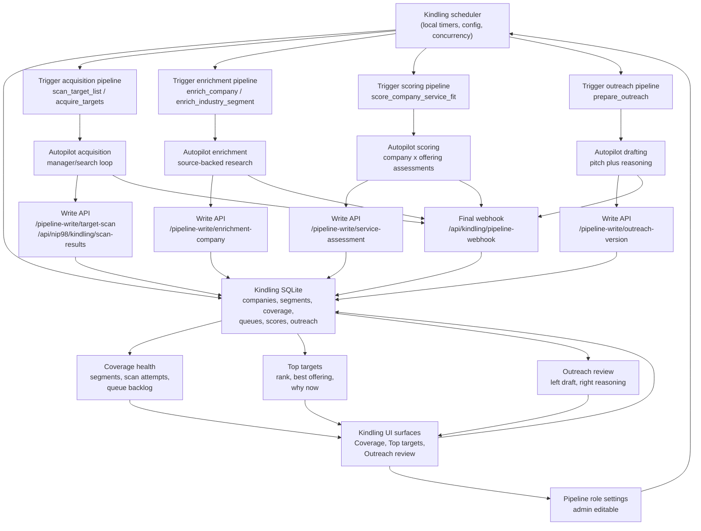

# Kindling Automated Prospecting Loop Design

Date: 2026-06-09

Status: design review draft only. This document proposes the next Kindling architecture for Adapt. It does not implement product code, migrations, pipeline functions, UI changes, or deployed pipeline changes.

## Executive Recommendation

Kindling should evolve from a staged manual WApp into a scheduled prospecting engine while preserving the current ownership boundary:

- Kindling WApp owns scheduler decisions, local SQLite state, user-visible records, queue state, review UI, write APIs, access control, and webhook/run lifecycle.
- Autopilot owns long-running research, enrichment, scoring, and drafting work. Pipelines receive bounded work packets and return structured outputs through Kindling write APIs plus final webhooks.

The first automated version should keep a configurable float of records:

- approximately 10,000 companies in the broad target pool,
- approximately 50 enriched companies ready for scoring at any time,
- approximately 50 to 100 prioritized top targets with service-offering fit, evidence, and outreach positioning.

These are operating defaults, not hard limits. They should live in scheduler configuration so Pete or an admin can tune the loop as lead quality improves.

## Current Repo Map

The proposal builds on these existing repo assets:

| Area | Current file or directory | What exists now | Design implication |
| --- | --- | --- | --- |
| App ownership model | `README.md` | WApp owns UI, Nostr login, access rules, business records, local SQLite, role mappings, webhooks, and write APIs. Autopilot owns pipeline runs and agent work. | Keep this split. Add scheduler and queue state to the WApp side. |
| Data model | `docs/DataModel.md`, `src/db.ts` | Companies, sources, activities, discovery jobs, scan strategy attempts, enrichment requests, target rankings, outreach drafts, pipeline roles, pipeline runs. Docs also describe future owner companies, people, customer profile versions, company matches, and outreach feedback. | Add first-class hierarchy, queue, service-assessment, score snapshot, and outreach version records. Normalize ring/status terms. |
| Pipeline contracts | `docs/AutopilotPipelineContracts.md` | Stable trigger/webhook envelope, target scan loop, company enrichment, draft outreach, service-offering update. | Extend role set with acquisition scheduler context, scoring, and outreach preparation while preserving the common envelope. |
| Implementation direction | `docs/ImplementationPlan.md` | Full thin path first, WApp owns SQLite, Autopilot uses APIs, pipeline settings are admin-only. | Next implementation should be phased and validate each loop before adding deeper automation. |
| Target scanning | `docs/TargetScanning.md` | Breadth-first discovery, nested geography/industry coverage, strategy attempts, partial writes, scan context API, NIP-98 scan results. | Use this as the acquisition loop foundation; add scheduled segment selection and coverage targets. |
| Service offering | `docs/ServiceOfferingWorkspace.md` | Market profile versions, service lines, matching rules, documents, outreach voice. | Add explicit service-offering variants and per-company x offering assessments. |
| Pipeline definitions | `bootstrap/pipelines/definitions/` | Working role definitions for service-offering update, target scan loop, company enrichment, industry enrichment batch, outreach draft, plus stubs. | Reuse and extend roles rather than replacing them. |
| Pipeline functions | `bootstrap/pipelines/functions/` | Deterministic normalizers and write/webhook delivery functions for scan, enrichment, profile update, and outreach. | Add new normalizers for scoring and outreach review versions later; do not let agents write SQLite directly. |
| Existing scheduler hint | `src/auto-enrichment-job.ts` | Automated industry enrichment job exists for batch enrichment. | Treat this as a seed for the broader scheduler, not the whole operating loop. |

## Target Operating Model

Kindling should run a local loop that wakes on a schedule, inspects SQLite state, chooses the next best unit of work, starts an Autopilot pipeline, records run state, and accepts structured writebacks.

Autopilot should never decide the global business process. Each pipeline can plan within a bounded unit, for example "find companies in this segment slice" or "score this company against this service offering", but Kindling chooses which segment, company, offering, and queue item runs next.

The operating loop has five recurring jobs:

1. Acquisition: keep the broad company pool healthy by segment.
2. Enrichment: keep enough promising companies source-backed and structured.
3. Initial ranking: choose which enriched companies deserve expensive scoring.
4. Service scoring: assess company x service-offering fit.
5. Outreach preparation: draft and explain pitches for top opportunities.

Human users work primarily in three surfaces:

- Coverage: industry/segment hierarchy, counts, scan coverage, queue health.
- Top targets: prioritized companies with fit, timing, and next action.
- Outreach review: proposed message on the left, evidence/reasoning on the right.

## Editable Industry and Segment Hierarchy

Kindling needs a first-class, editable target hierarchy. The hierarchy is not an industry-code taxonomy. It is Adapt's go-to-market map.

Recommended seed shape from the 2026-06-04 Adapt note:

- Tier 1: SME advisory and referral-rich firms.
- Tier 2: owner-led professional services.
- Tier 3: operational SMEs with scale pain.
- Tier 4: regulated or high-trust service businesses.
- Tier 5: later expansion or opportunistic segments.

Each node can have children. For v1, a practical default is 10 broad areas with about 20 narrower sub-areas, but the schema should not hard-code depth or counts.

Each segment should store:

- label, parent, priority, active/parked state,
- geography focus, default target count, default batch size,
- scan prompts and synonyms,
- coverage targets for found, enriched, scored, and outreach-ready counts,
- last acquisition, enrichment, scoring, and outreach run timestamps,
- attempts, net-new yield, dedupe rate, weak-source rate, and stalled reason.

Initial Adapt hierarchy should prioritize Perth and Tier 1 SME advisory firms:

- financial planning and wealth advisory,
- accounting, tax, bookkeeping, and business advisory,
- legal firms serving SMEs, family businesses, succession, commercial law, employment, estate planning, or M&A,
- HR consulting, leadership advisory, and organizational development,
- outsourced CFO, business coaching, strategy consulting,
- insurance, risk, mortgage, finance, and commercial lending brokers with SME owner relationships.

## Coverage Model

Coverage should answer: "Which segment/geography slices are producing useful, source-backed prospects and which are exhausted or stale?"

A coverage slice is a durable combination of:

- segment node,
- geography node or search geography string,
- source family,
- strategy type,
- status,
- target counts,
- actual counts,
- last run and next eligible run.

Kindling should track counts per segment and slice:

- found companies,
- unique companies,
- possible duplicates,
- weak-source records,
- enriched records,
- scoring-ready records,
- top-target records,
- outreach-ready records,
- contacted, parked, stale, and dismissed records.

This extends the current `discovery_jobs` and `scan_strategy_attempts` model. `scan_strategy_attempts` remains the detailed attempt log. New coverage tables should provide the persistent scheduler view across many jobs.

## Company State Machine

The current docs define rings `found`, `enhanced`, `matched`, `outreach`, and `parked`. Current code also contains older values such as `seed`, `manual`, `discovered`, and `enriched`. The automated loop should normalize this before adding more states.

Recommended canonical company states:

| State | Meaning | Primary next action |
| --- | --- | --- |
| `found` | Basic company record exists with at least a name plus a source, website, or directory reference. | Deduplicate or enrich. |
| `enrichment_queued` | Company is selected for enrichment and waiting on an Autopilot run. | Wait or release on timeout. |
| `enrichment_running` | Enrichment pipeline is active. | Accept partial/final write. |
| `enhanced` | Source-backed company profile exists with structured fields and confidence. | Initial rank. |
| `ranked` | Initial priority score exists for deeper scoring selection. | Score against service offerings. |
| `scored` | One or more service-offering fit assessments exist. | Promote to top targets or park. |
| `outreach_ready` | Pitch/reasoning exists and can be reviewed. | Human review/call/email. |
| `contacted` | Outreach activity has happened. | Follow up, retry, or close. |
| `parked` | Not useful now, with reason. | Revisit if segment/source changes. |
| `stale` | Previously useful but data or score is old. | Re-enrich or rescore. |

Implementation can preserve `companies.data_ring` for coarse ring display and add explicit queue/status records for transient states. Do not overload one `data_ring` column with both data maturity and pipeline execution state.

## Scheduled Target Acquisition Loop

The acquisition scheduler should run periodically, for example hourly. On wake:

1. Read scheduler config and active segment hierarchy.
2. Compute segment deficits: target found count minus unique source-backed found count, adjusted by priority, freshness, yield, and queue pressure.
3. Select one or more segment/geography coverage slices needing more companies.
4. Create an acquisition job in Kindling.
5. Trigger `scan_target_list` or a future `acquire_targets` role with compact context:
   - selected segment,
   - geography,
   - target count,
   - previous attempts and blocked strategies,
   - desired source families,
   - duplicate and weak-source history,
   - write API and final webhook.
6. Accept partial writes through the existing target-scan write API.
7. Store found companies, sources, possible duplicates, executed search slices, planned next strategies, and coverage metrics.
8. Mark the job partial, complete, failed, or exhausted.

The acquisition loop should keep using the `TargetScanning.md` manager-loop model: Autopilot can choose concrete search slices within a bounded run, but Kindling supplies prior coverage and persists every executed strategy.

Default policy:

- Do not start acquisition if active acquisition runs are at concurrency limit.
- Prefer segments below minimum found-count floor.
- Penalize slices with low recent net-new yield.
- Revisit stalled slices only after cooldown or when new strategy families are added.
- Keep planned-next strategies separate from executed attempts.

## Enrichment Queue and Output Shape

Kindling should maintain a queue of companies that are good enough to enrich. Enrichment should not run blindly across every found record.

Selection inputs:

- segment priority,
- source quality,
- has website or strong public source,
- duplicate status,
- Perth/WA relevance,
- owner-led or SME advisory hints,
- public signal hints,
- enrichment staleness,
- current backlog against the enriched-company target.

The existing `enrichment_requests` table and `enrich_industry_segment` role are a useful start. The next design needs richer queue metadata: priority, reason, segment, stale/retry fields, attempts, lock/run ownership, and failure reason.

Structured enrichment should produce or update:

- `companies`: name, website, industry, location, normalized segment ids, coarse data ring, confidence.
- `sources`: source type, URL, title, summary, extracted fields, confidence, last checked metadata.
- `customer_profile_versions`: source-backed profile snapshots.
- `people`: public decision-maker and team signals where allowed.
- `signals`: trigger evidence such as growth, hiring, succession, exit, acquisition, AI adoption, leadership change, new office, new service, content post, event, partnership.
- `activities`: audit trail for what changed.

Minimum enrichment JSON shape:

```json
{
  "outputKind": "company_enrichment",
  "companyId": "uuid",
  "companyName": "Example Advisory",
  "profilePatch": {
    "summary": "",
    "description": "",
    "servicesOffered": [],
    "customerTypes": [],
    "size": {
      "employeeCountBucket": "10-30",
      "locationCount": 1,
      "confidence": 0.6
    },
    "ownership": {
      "ownerLedLikelihood": 0.7,
      "ownershipType": "partner_owned",
      "confidence": 0.55,
      "notes": ""
    },
    "contactPaths": [],
    "segmentIds": [],
    "gaps": []
  },
  "signals": [
    {
      "signalType": "succession",
      "summary": "",
      "sourceUrl": "",
      "observedDate": null,
      "strength": "medium",
      "confidence": 0.7,
      "adaptRelevance": ""
    }
  ],
  "sources": [],
  "fieldsUpdated": [],
  "warnings": [],
  "confidence": 0.75
}
```

## Initial Ranking

Initial ranking is a cheap local or lightweight pipeline step that decides which enhanced companies deserve detailed service-offering scoring.

It should not replace full scoring. It should rank by:

- source quality,
- Perth/WA fit,
- segment priority,
- owner-led likelihood,
- employee-size band,
- public trigger count and strength,
- service advisory/referral potential,
- reachability,
- freshness,
- missing-field risk.

The current `target_rankings` table can store a simple rank and `score_json`, but it is not enough for multiple score snapshots, ranked list history, or separating initial ranking from service-specific scoring. Add `ranking_runs` and `ranking_items` or extend `target_rankings` with `ranking_run_id`, `ranking_type`, `segment_id`, and `market_profile_version_id`.

## Scoring Against Adapt Service Offerings

Adapt should not use a single generic fit score. Each company should be assessed against multiple service offerings and variants.

Known service-offering lines from current docs:

- AI consulting,
- Wingman implementations,
- custom WApps,
- training.

Useful Adapt positioning variants from the 2026-06-04 note:

- Scale,
- Exit,
- Succession,
- Handover,
- Maximising business value,
- Reducing owner dependence.

Recommended scoring unit:

```text
one company x one active service offering or variant
```

If 10 companies and 5 offerings are selected, Kindling should create 50 independent assessment queue items. Autopilot can run these in parallel within configured concurrency limits.

Each assessment returns:

- score, band, and confidence,
- evidence ids and source URLs,
- fit explanation,
- caveats and disqualifiers,
- best variant,
- recommended next action,
- outreach angle seed,
- human-review flag when evidence is weak.

Suggested scoring dimensions:

- `service_fit`,
- `timing`,
- `owner_dependence`,
- `scale_pain`,
- `succession_exit`,
- `advisory_partner_value`,
- `reachable_contact`,
- `evidence_quality`,
- `risk_or_compliance`.

Scoring result shape:

```json
{
  "outputKind": "service_fit_assessment",
  "companyId": "uuid",
  "marketProfileVersionId": "uuid",
  "serviceOfferingId": "uuid",
  "variantKey": "succession",
  "score": 84,
  "band": "high",
  "confidence": 0.78,
  "drivers": {
    "serviceFit": 0.86,
    "timing": 0.72,
    "ownerDependence": 0.7,
    "scalePain": 0.62,
    "successionExit": 0.9,
    "advisoryPartnerValue": 0.82,
    "reachableContact": 0.65,
    "evidenceQuality": 0.8,
    "riskOrCompliance": 0.35
  },
  "fitExplanation": "",
  "evidence": [
    {
      "sourceId": "uuid",
      "sourceUrl": "",
      "claim": "",
      "confidence": 0.8
    }
  ],
  "caveats": [],
  "recommendedNextAction": "prepare_outreach",
  "outreachAngleSeed": ""
}
```

## Prioritized Top-Target List

Kindling should assemble service assessments into a top-target list. This is a WApp-owned materialized view or table, not an Autopilot transcript.

Ranking formula should combine:

- best service assessment score,
- second-best service assessment score,
- trigger recency,
- evidence quality,
- reachability,
- segment priority,
- human feedback,
- freshness penalty,
- compliance/caveat penalty.

Top targets UI should show:

- company name, segment, location, website,
- rank and band,
- best service offering and variant,
- why this company,
- why now,
- best next action,
- evidence confidence,
- caveats,
- status buttons: review, call, email, defer, dismiss, park, mark contacted.

The list should refresh from scheduled jobs and writebacks. A user can manually request refresh, but the normal state should not depend on manual regeneration.

## Outreach Pitch and Reasoning Review Surface

For high-scoring targets, Kindling should trigger outreach preparation. The UI should use a two-column review:

- Left: proposed cold email, call opener, and short follow-up note.
- Right: reasoning and evidence for why this target and pitch are good.

The right column should include:

- matched service offering,
- selected variant,
- source-backed claims,
- claims to avoid,
- assumptions,
- caveats,
- confidence,
- alternative angle if the user rejects the pitch.

Outreach should be versioned. The current `outreach_drafts.pitch_text` markdown field is fine for a thin path, but automated review needs structured versions:

- outreach opportunity id,
- selected assessment id,
- version number,
- draft kind,
- subject/opening/body/call-to-action fields,
- reasoning JSON,
- evidence ids,
- status,
- human edits,
- source run id.

Sending email, LinkedIn automation, and CRM sync are not in scope for this design pass.

## Mermaid Architecture Diagram



## Schema Gaps

The current schema is enough for the thin path and first automated enrichment. It is not yet enough for the full automated prospecting engine.

Recommended additions:

| Gap | Current state | Proposed table or field |
| --- | --- | --- |
| Segment hierarchy | `industry` text on companies/jobs. No editable hierarchy. | `target_segments(id,parent_id,label,tier,priority,status,default_geo,coverage_targets_json,scan_prompts_json,created_at,updated_at)` |
| Segment membership | Company has one text industry. | `company_segments(company_id,segment_id,confidence,source,created_at)` |
| Geography hierarchy | Location is free text. | `target_geographies(id,parent_id,label,kind,canonical_key,status)` and optional `coverage_slices.geography_id` |
| Persistent coverage | `discovery_jobs` and `scan_strategy_attempts` are job/attempt history. | `coverage_slices(id,segment_id,geography_id,source_family,status,target_counts_json,current_counts_json,last_run_at,next_run_after_at,yield_json)` |
| Scheduler config | No broad scheduler config. `auto-enrichment-job.ts` exists for one batch job. | `scheduler_settings`, `scheduler_runs`, `scheduler_locks` |
| Queue state | `work_queue` stores company enrichment queue state and `enrichment_requests.work_queue_id` keeps manual/industry enrichment compatibility. | Reuse `work_queue(id,kind,target_type,target_id,segment_id,segment,priority,status,reason,attempts,next_run_after_at,locked_by_run_id,error,context_json)` for later scoring/outreach queue kinds when those tickets land. |
| Signals | Enrichment signals currently live in JSON blobs. | `signals(id,company_id,signal_type,summary,source_id,source_url,observed_date,strength,confidence,adapt_relevance,created_at)` |
| People | Documented but not implemented in `src/db.ts`. | `people` from `docs/DataModel.md` |
| Profile versions | Documented but not implemented in `src/db.ts`. | `customer_profile_versions` |
| Company matches | Documented but not implemented in `src/db.ts`. | `company_matches` for profile-level fit, plus service assessment tables |
| Service offerings | Services currently live inside `market_profile_versions.structured_json`. | Decision for scoring: keep JSON as the source profile document and extract version-tied `service_offerings(id,market_profile_version_id,key,name,variant_key,structured_json,status)` rows for stable scoring identities. |
| Service assessment rows | `target_rankings.score_json` can hold one blended score only. | `service_fit_assessments(id,company_id,service_offering_id,market_profile_version_id,score,band,confidence,drivers_json,evidence_json,caveats_json,next_action,source_run_id,created_at)` |
| Top-target snapshots | `target_rankings` exists but has no run/list snapshot. | `target_list_runs` and `target_list_items` or extend `target_rankings` with run/list fields |
| Outreach versions | `outreach_drafts.pitch_text` stores markdown only. | `outreach_opportunities`, `outreach_versions`, `outreach_feedback` |
| Evidence linkage | `sources` exists but lacks title/extracted data/last checked fields in implemented schema. | Align `sources` with `docs/DataModel.md`; add join table `assessment_evidence` if needed |
| Status normalization | Docs and code use different ring names. | Migration to canonical ring/status values plus compatibility mapping |

## API Gaps

Existing useful APIs:

- `GET /api/kindling/summary`
- `GET /api/kindling/companies`
- `POST /api/kindling/companies`
- `POST /api/kindling/service-offering`
- `POST /api/kindling/target-scans`
- `POST /api/kindling/companies/:companyId/enrich`
- `POST /api/kindling/companies/:companyId/outreach`
- `POST /api/kindling/pipeline-webhook`
- `POST /api/kindling/pipeline-write/target-scan`
- `POST /api/kindling/pipeline-write/enrichment-company`
- `GET /api/nip98/kindling/scan-context`
- `POST /api/nip98/kindling/scan-results`
- `GET /api/kindling/todays-targets`

Recommended new APIs:

- `GET/POST/PATCH /api/kindling/target-segments`
- `GET/PATCH /api/kindling/coverage-slices`
- `GET/PATCH /api/kindling/scheduler-settings`
- `POST /api/kindling/scheduler/run-once`
- `GET /api/kindling/work-queue`
- `POST /api/kindling/work-queue/:id/retry`
- `GET /api/kindling/scoring/context?companyId=...`
- `POST /api/kindling/service-assessments`
- `POST /api/kindling/pipeline-write/service-assessment`
- `POST /api/kindling/pipeline-write/outreach-version`
- `GET /api/kindling/top-targets`
- `POST /api/kindling/top-targets/rebuild`
- `GET /api/kindling/outreach-opportunities/:id`
- `POST /api/kindling/outreach-opportunities/:id/versions`
- `POST /api/kindling/outreach-feedback`

Autopilot-facing APIs should use token-scoped write APIs for pipeline runs and NIP-98 APIs where user-scoped access is required. Pipelines should not open the SQLite database directly.

## Pipeline Contracts

All roles should keep the current common trigger envelope:

```json
{
  "input": {
    "source": "kindling-wapp",
    "pipelineRole": "role_key",
    "requestId": "local-request-id",
    "userNpub": "npub1...",
    "message": "bounded instruction",
    "localContext": {},
    "webhook": {
      "url": "https://kindling.example/api/kindling/pipeline-webhook",
      "authHeader": "x-kindling-pipeline-token",
      "token": "run-scoped-token"
    }
  }
}
```

### Acquisition

Role key: keep `scan_target_list` initially; later add `acquire_targets` only if the contract diverges.

Input additions:

- `segment`,
- `geography`,
- `coverageSlice`,
- `priorScanStrategies`,
- `coverageTargets`,
- `writeApi`,
- `targetCount`,
- `maxLoops`.

Output:

- same `target_scan_result` shape from `docs/AutopilotPipelineContracts.md`,
- plus `segmentId`, `coverageSliceId`, `netNewCount`, `dedupeCount`, `weakSourceCount`, and `coverageSummary`.

### Enrichment

Role keys: existing `enrich_company` and `enrich_industry_segment`.

Input additions:

- `segmentContext`,
- `requestedFields`,
- `knownSources`,
- `knownSignals`,
- `serviceOfferingSummary`,
- `writeApi`.

Output:

- existing `company_enrichment`,
- plus structured `signals`, `people`, `ownership`, `size`, `segmentMembership`, and `profileVersion`.

### Scoring

New role key: `score_company_service_fit`.

Input:

```json
{
  "companyId": "uuid",
  "company": {},
  "customerProfileVersion": {},
  "sources": [],
  "signals": [],
  "serviceOffering": {},
  "marketProfileVersion": {},
  "scoringRubric": {},
  "writeApi": {}
}
```

Output: `service_fit_assessment`, one row per company x service offering.

### Outreach

Role key: extend `draft_outreach` or add `prepare_outreach` if the new review surface needs separate persistence.

Input additions:

- best service assessment,
- selected variant,
- evidence bundle,
- claims to use,
- claims to avoid,
- outreach voice,
- previous outreach versions if any.

Output:

- existing `outreach_draft` for backward compatibility,
- plus `outreach_version` with structured left-column draft and right-column reasoning.

## Concrete Recovered Test Case

Pete's brief asked to recover a strong Subiaco legal-firm example that appeared family-run, discussed succession publicly, and helped clients with succession.

Search result caveat: I did not find one recovered record that cleanly satisfies all three attributes. The recovered examples split across several records:

- `Janssen + Maluga Legal`: recovered as a Subiaco German-Australian law firm with official wills, estate administration, probate, estate planning, disputes, cross-border estate matters, public directors/team roles, and Subiaco contact details.
- `AVA Legal`: recovered as a Subiaco boutique law firm with property, commercial, liquor licensing, wills/probate, estate planning, and a small specialist team.
- `Matich Law`: recovered as a boutique firm with same-surname public people signals and an independent Subiaco Hotel transaction reference, but location is Nedlands and succession was not official-source backed.
- `Summers Legal`: recovered as a West Perth commercial law firm with an official commercial-law page mentioning succession planning, but it is not Subiaco and the family-run signal was not established.

For design validation, use a generic "Subiaco legal succession" fixture based on the first two records rather than hard-coding an unsupported single company claim.

Expected scoring behavior for this fixture:

- Segment: Tier 1 SME advisory and referral-rich firms > legal firms > wills/estates/commercial/succession.
- Enrichment should capture service evidence, team/ownership hints, public contact paths, source confidence, and caveats.
- Signals should include `succession` only when source-backed by services or content.
- Service scoring should likely rate Succession, Handover, and Reducing owner dependence variants higher than generic training.
- Outreach reasoning must cite the estate/succession/service evidence and avoid claiming the firm has its own succession problem unless there is direct evidence.

## Phased Implementation Plan

### Phase 0: Design Approval

Validation:

- Review this document with Pete/wm21.
- Confirm status vocabulary.
- Confirm initial target hierarchy and default operating thresholds.
- Confirm whether "service offerings" should stay inside market profile JSON or be extracted to queryable rows.

### Phase 1: Normalize State and Add Hierarchy

Build:

- canonical ring/status migration,
- `target_segments`,
- company-segment membership,
- basic coverage slices,
- read/write APIs for segments and coverage,
- seed Perth-first Adapt hierarchy.

Validation:

- existing tests still pass,
- existing companies remain visible,
- target scan still writes companies,
- coverage counts match company filters.

### Phase 2: Scheduler and Acquisition Loop

Build:

- scheduler settings,
- scheduler run log/locks,
- acquisition selector,
- scheduled trigger for existing `scan_target_list`,
- coverage updates from partial writes and final webhook.

Validation:

- dry-run explains selected segment without triggering,
- run-once starts one acquisition job,
- prior scan strategies are passed,
- planned strategies are not stored as attempted strategies.

### Phase 3: Enrichment Queue Upgrade

Build:

- queue priority metadata,
- structured enrichment output persistence for profile versions and signals,
- richer source fields,
- stale/retry handling,
- dashboard queue health.

Validation:

- queued companies release on run failure/timeout,
- enrichment write creates sources, activities, signals, and active profile version,
- weak evidence is stored with confidence and caveats.

### Phase 4: Initial Ranking and Service Scoring

Build:

- initial ranking run records,
- service offering extraction or stable JSON lookup,
- `score_company_service_fit` pipeline role contract,
- service assessment write API,
- top-target aggregation.

Validation:

- 10 companies x 5 offerings creates 50 assessment work items,
- duplicate writes are idempotent by company/offering/profile version/run,
- top-target ordering explains its score,
- low-confidence evidence lowers ranking or flags review.

### Phase 5: Outreach Review Surface

Build:

- outreach opportunity/version records,
- structured outreach write API,
- two-column review surface,
- feedback actions.

Validation:

- high-scoring target can produce a draft plus reasoning,
- evidence links are visible,
- user edits create a new version or preserve original,
- status changes affect top-target queue.

### Phase 6: Review Cadence and Learning Loop

Build:

- weekly review metrics,
- feedback-to-score adjustments,
- segment yield dashboard,
- parked/stale revisit policy.

Validation:

- review can answer lead quality, scoring accuracy, enrichment gaps, caller usefulness, and UX friction,
- segment priorities can be changed without code edits.

## Validation Checks for Future Implementation

Minimum checks after each phase:

- `bun run check`
- `bun test`
- manual run of relevant scheduler `run-once` endpoint in dry-run mode,
- verify no pipeline writes bypass Kindling APIs,
- verify failed/partial runs leave queue items recoverable,
- verify UI counts match SQLite counts for key states,
- verify evidence/caveats are visible before outreach.

Quality checks:

- no outreach claim without source evidence or explicit "inference" label,
- top-target list contains reason and next action for every item,
- every scored company has at least one service-specific assessment,
- every scheduler decision has an activity or run-log explanation,
- repeat scans do not reinsert planned-only strategies as completed attempts.

## Not Yet Scope

Do not build these in the next implementation pass unless Pete explicitly changes scope:

- email sending,
- LinkedIn login/browser automation,
- paid data provider integration,
- CRM sync,
- automatic duplicate merging without human-review policy,
- autonomous outreach without human review,
- agent direct SQLite access,
- complex multi-tenant deployment changes,
- mobile-first redesign,
- full graph-memory dependency,
- large speculative schema unrelated to the scheduler, scoring, and review loop.

## Open Questions

- Should the canonical state name be `enhanced` from docs or `enriched` from current code paths? I recommend `enhanced` for data ring and `enrichment_*` for queue execution states.
Fine
- Should service offerings be extracted to relational rows immediately, or can scoring read them from active market-profile JSON for the first scoring phase?
Resolved in Ticket 13: scoring lists extracted `service_offerings` rows tied to a `market_profile_version_id`, while `market_profile_versions.structured_json` remains the editable source profile. This keeps old assessment references interpretable after profile changes.
- What are Pete's default operating targets for found, enhanced, scored, and outreach-ready counts per Tier 1 segment?
Make up something relevant
- Should the scheduler live in the WApp server process initially, or run as a separate local worker using the same SQLite database and APIs?
WApp server
- Which user should own review of parked records and stale evidence in the weekly cadence?
Just put them on a screen for review and they can be figured out later. 
