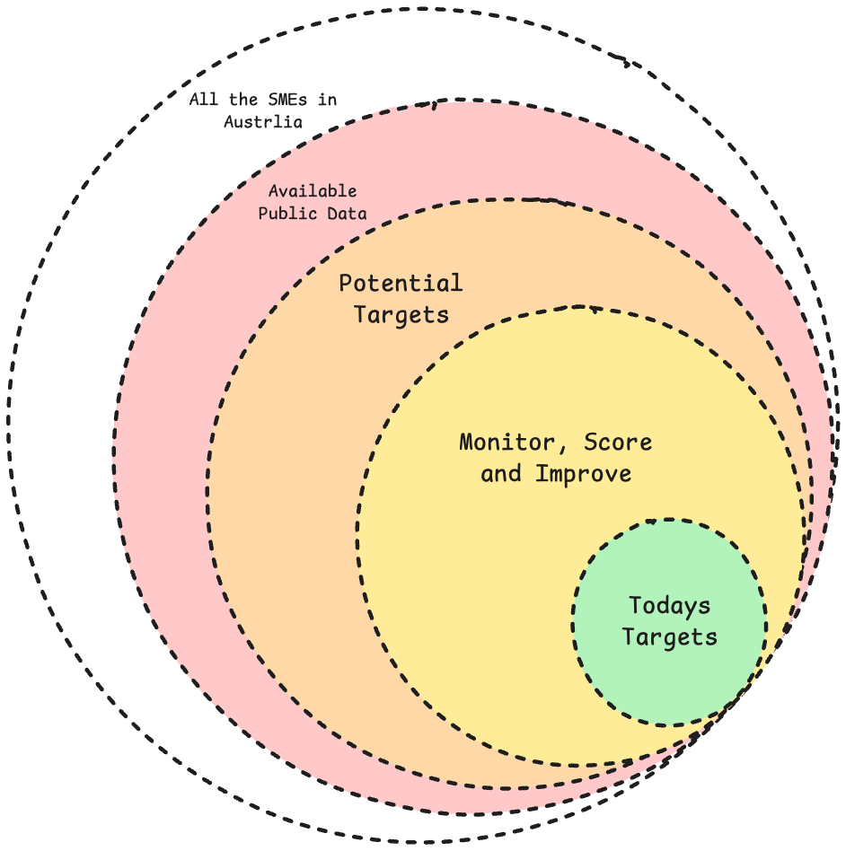

# Product Brief: Kindling WApp

## Purpose

Kindling is a WApp for building and improving a living list of small and medium enterprises in Australia. It should help turn the broad market of Australian SMEs into a focused set of today's best outreach targets by collecting public data, enriching client records over time, scoring fit and timing, and preparing targeted outreach.

The core job of the WApp is to make business development research compounding: every search, enrichment pass, note, score, and generated pitch should improve the quality of the client dataset and make the next outreach decision sharper.

## Product Concept

The product starts with the full universe of Australian SMEs, then narrows that universe through progressive layers:

- Raw SME records, which may initially be only a business name or sparse imported identity.
- Available public data about companies, people, sectors, geography, websites, hiring, signals, and contact paths.
- Potential targets that match the user's service offering, customer profile, and commercial constraints.
- Monitored and scored prospects whose records are revisited regularly as new information appears.
- Today's targets, selected because they have the clearest fit, strongest trigger, best contact path, or highest expected value.

For any specific client, the WApp should support repeated improvement until there is enough detail to produce either a targeted outreach email or a clear pitch for a specific set of services.

The WApp should be able to hold very large company lists while only spending expensive research and agent effort on records that have moved far enough through the data rings to justify deeper work.

## Intended Workflow

1. Add or discover Australian SMEs.
2. Store sparse records even when the only known data is a company name or identifier.
3. Find whether public data exists, including a website, business profile, directory record, public contact path, or other queryable source.
4. Park records that do not currently have enough public data to enrich cost-effectively.
5. Build structured company profiles for records with usable public data.
6. Use configurable search priorities to deepen specific niches, locations, company sizes, industries, or other promising segments.
7. Score prospects against fit, need, timing, reachability, value, confidence, and service match.
8. Monitor changes and revisit incomplete or high-potential records.
9. Select today's targets.
10. Generate targeted outreach emails and service pitches grounded in the client record and the user's positioning.

## Configurable Market Profile

Each WApp deployment needs a configurable market profile. This profile describes what the user offers, why it matters, which clients are attractive, and how benefits should be framed. The profile should be editable directly in the WApp and, later, updatable by an AI assistant with user review.

For the initial owner deployment, the starting services are:

- AI consulting
- Wingman implementations
- Custom WApps
- Training

Baseline profile structure:

- Positioning: how the user wants to be understood in the market.
- Services: named service lines with descriptions, delivery modes, prerequisites, likely budgets, and sales cycle expectations.
- Benefits: concrete business outcomes each service can create for a client.
- USPs: specific differentiators, proof points, advantages, methodology, speed, local knowledge, platform ownership, or implementation depth.
- Ideal client profile: industries, company sizes, maturity signals, roles, pains, readiness indicators, and exclusion rules.
- Buying triggers: visible events or public signals that suggest a client may need a service now.
- Objection handling: likely objections and the response strategy.
- Outreach voice: tone, level of directness, claim style, and proof threshold.
- Offer-to-client matching rules: how company attributes map to likely services, benefits, and pitch angles.

The profile should become part of the scoring and outreach context. The WApp is not only asking "is this a good company?" but "is this a good company for this user's current services, positioning, and preferred outreach strategy?"

The profile should not be treated as static configuration. It should be developed through an interview-style Autopilot pipeline where the user can provide context, answer focused questions, review the current positioning, and let the pipeline refine the structured market profile over time.

Market profiles should be versioned records. A positioning conversation can produce version 2 from version 1, then version 3 from version 2, and so on. Users should be able to flick between versions, inspect what changed, and see short rationale notes explaining why the pipeline made each change. The app can update to the newest version automatically, but previous versions must remain available for comparison and rollback.

The initial profile creation flow should support loading a large amount of starting context about the user's business, then using the interview pipeline to progressively improve the profile through conversation.

See [Service Offering Workspace](./ServiceOfferingWorkspace.md) for the detailed flow.

For the initial owner deployment, early target-shape assumptions are:

- Buyer or influential manager in an organisation of roughly 5 to 100 people.
- Perth-based or strongly connected to the Perth market.
- Some visible interest in AI, automation, workflow improvement, or related business transformation.
- Evidence of an "aha moment", such as posting about AI, commenting on AI content, experimenting with AI tools, or signalling that they see a relevant opportunity.

These assumptions should be editable and should be challenged by the positioning pipeline as better evidence accumulates.

## Data Rings

Kindling should progressively move records through concentric data rings:

1. Known SME: the company exists in the database, but may only have a name or weak identifier.
2. Publicly findable: the system has found a website, business profile, directory result, search result, or other public source.
3. Profiled: the WApp has extracted enough structured information to understand the company's industry, location, offer, size hints, key people, and source confidence.
4. Segment candidate: the company belongs to a segment the user currently wants to improve, such as a niche, location, size band, or priority industry.
5. Scored target: the company has been evaluated against the configured market profile and current campaign priorities.
6. Monitored prospect: the company is worth revisiting regularly for new signals or improved confidence.
7. Today's target: the company is selected for current outreach preparation.
8. Outreach-ready: the WApp has enough source-backed detail to produce a deliberate first email, pitch angle, or service recommendation.

Records can move backward or be parked if sources disappear, confidence falls, or there is not enough public data to justify more work.

Important parking criteria:

- No usable public data can be found.
- No website, directory profile, public business profile, or other source can be confidently linked to the company.
- No relevant public individuals can be identified.
- The WApp cannot monitor staff, managers, founders, or likely buyers through public profiles or public activity.

## Discovery and Enrichment Strategy

The system should prefer deterministic tools and APIs wherever possible, using agents to plan, decide, interpret, and synthesize rather than to manually browse every step. Pipelines should be able to run search tools, enrichment tools, source extractors, and scoring passes, then hand compact results to agents only when judgment is needed.

Expected source categories include:

- Company websites
- LinkedIn and public professional profiles where available
- ASIC, ABR, and other Australian business registers where useful and lawful
- Google Maps or local business directories
- Industry directories
- Job ads and hiring pages
- News and announcements
- Technology detection sources such as BuiltWith-style data
- Search results and other public web references

The long-term pattern is daily or repeated jobs that build the large list, enrich chosen slices of the list, and improve priority segments without launching expensive agent work for every raw company record.

See [Target Scanning](./TargetScanning.md) for the detailed discovery and batch-enrichment flow.

Discovery should be staged as a waterfall rather than one large all-purpose agent pass. The first discovery stage should focus on finding companies and source links only. Later stages can take selected company records and enrich them with people, confidence, public signals, monitoring points, scoring, and outreach material. This keeps long-running scans narrow, cheap to reason about, and easier to resume or audit.

## Autopilot Pipeline Responsibilities

Kindling is a joint WApp and Wingman Autopilot product. The WApp should not try to embed all complex reasoning in local app code. It should define clear pipeline contracts and offload deeper thinking to Autopilot.

Early pipeline candidates:

- Positioning interview pipeline: asks the user focused questions, incorporates answers, evaluates the current market profile, and proposes structured updates to services, benefits, USPs, ICP rules, triggers, and outreach voice.
- Positioning revision pipeline: takes the current profile, conversation context, and new user input, then creates a new versioned profile with a change summary and rationale notes.
- Search planning pipeline: turns the current market profile and campaign priorities into concrete discovery plans, such as niches, locations, search terms, source choices, and batch sizes.
- Company discovery pipeline: runs long-lived or agent-led scans for a specific geography, industry, or search slice and writes company records, candidate websites, source links, and scan activities back to the WApp.
- Duplicate resolution pipeline: periodically reviews possible duplicate records, merges or links confirmed duplicates, and leaves evidence for ambiguous cases.
- Source enrichment pipeline: runs deterministic tools and extractors for selected companies, then summarizes evidence and confidence.
- People discovery pipeline: runs after company discovery or prioritisation to identify public staff, managers, founders, likely buyers, contact paths, and person-level monitoring points.
- Company profiling pipeline: converts source data into structured company records, people records, signals, and gaps.
- Monitor and score pipeline: watches public signals, scores fit and timing, and recommends which records deserve more work.
- Today's targets pipeline: selects the best effort for today based on fit, timing, confidence, reachable people, active signals, and current campaign goals.
- Outreach drafting pipeline: uses the current company record and market profile to draft and iterate a deliberate first outreach email or pitch.

Pipeline outputs should be proposed changes, scores, or artifacts that the WApp can display, store, diff, accept, reject, and revisit.

## Initial Screen and Actions

The first screen should answer "what do we want to do today?" and expose a small number of clear actions instead of starting as a passive dashboard.

Initial action areas:

- Build service offering: opens the positioning workspace, showing the current market profile, version history, change notes, and a chat interface for the interview pipeline.
- Build target list: shows the current generated name database, including counts by industry, location, data ring, and confidence. The user can enter free-text location, industry, and optional targeting notes, then manually kick off a pipeline to discover initial company records.
- Review today's targets: shows the current best outreach opportunities as a priority-ordered list once enough monitoring and scoring data exists.
- Act: prepares or reviews a copyable pitch for selected targets.

These actions should live on an action hub framed around "what will we do today?" rather than on a passive dashboard.

The four primary actions should have equal visual weight.

The first practical happy path is: define or improve the service offering, build a target list for one industry and location, enrich a small number of companies from that list, then draft one outreach email or pitch.

See [WApp Implementation Shape](./WAppImplementationShape.md) for the first screen set, local SQLite choice, manual CRUD expectation, and pipeline-role configuration model.

## Target Outputs

The WApp's primary output is an always-improving dataset. Outreach artifacts are produced when records reach sufficient confidence.

Outreach preparation should:

- Use the current company profile and source-backed facts.
- Match the company against the user's market profile, services, benefits, and USPs.
- Select the strongest relevant service angle rather than producing generic outreach.
- Draft a deliberate pitch that can be copied and pasted into an email.
- Support iteration on the draft before it is used.

Sending outreach is not part of the first version. The WApp prepares high-quality copyable pitch material for review first, with direct sending considered later.

Today's targets should represent the best effort for the current day, not simply the highest static score. A strong trigger, such as a relevant manager actively publishing or engaging with AI content, can create a high-confidence outreach moment even if the broader company profile is still incomplete.

## Monitoring Model

Monitoring should exist at both the company level and the person level. A company can have monitoring points such as its website, public blog, hiring pages, events, directory profiles, news mentions, or technology footprint. People associated with the company can also have monitoring points such as personal websites, blogs, public LinkedIn activity, event appearances, newsletters, or other public profiles.

Signal quality should be ranked. Deliberate public writing by the person or company is highest quality, because it shows their own words, priorities, and timing. A personal blog or company blog should usually outrank weaker signals such as indirect directory updates. A rough initial priority order is:

1. Personal blog, personal website, company blog, or first-party public writing.
2. LinkedIn posts and comments.
3. Company website changes.
4. Job ads and hiring pages.
5. Events, talks, webinars, newsletters, or public appearances.
6. Directory, map, technology, and other secondary public updates.

Monitoring rules should be configurable as part of the market profile and campaign settings, because different users and service offerings may care about different signals.

See [Company Profiles](./CompanyProfiles.md) for the detailed profile, activity, confidence, and augmentation model.

## Early Data Model

Likely first-class records:

- Market profile
- Market profile version
- Profile change note
- Service
- Benefit
- USP or proof point
- Ideal client profile rule
- Buying trigger
- Positioning interview session
- Positioning revision
- Search priority
- Pipeline role configuration
- Discovery job
- Discovery slice
- Geography hierarchy node
- Company
- Possible duplicate group
- Contact
- Public person profile
- Person monitoring point
- Company monitoring point
- Source
- Research note
- Signal or trigger
- Fit score
- Service match
- Monitoring rule
- Outreach draft
- Service pitch
- Activity or enrichment run

## WApp Role

The WApp should own the local user experience, records, scoring state, market profile, and review workflow. Autopilot pipelines can be used for research planning, deterministic tool orchestration, enrichment, scoring suggestions, summarisation, pitch generation, and outreach drafting, with results posted back to the WApp for review.

The first implementation should keep WApp data in local SQLite. Autopilot should use WApp NIP-98 APIs rather than direct SQLite access.

The first deployment user is the owner. The product should also be deployable for a second client, which means market positioning, services, benefits, target profiles, and scoring rules must not be hard-coded to the owner's business.

For positioning, the WApp should show the current structured profile and provide a chat interface where the user can discuss, refine, and be interviewed about it. Each meaningful chat turn can trigger an Autopilot pipeline that reviews the existing profile, interprets the new input, asks the next useful question, and proposes concrete profile updates.

Pipeline choices should also not be hard-coded. Kindling should let an admin/operator select the Autopilot pipeline used for each role, such as service-offering development, target-list scanning, enrichment, duplicate cleanup, people discovery, scoring, and outreach drafting.

## Open Questions

- What fields must be known before a company can become one of today's targets?
- What scoring criteria should matter most?
- How often should client records be revisited?
- What does a successful first version need to do manually, semi-automatically, and automatically?
